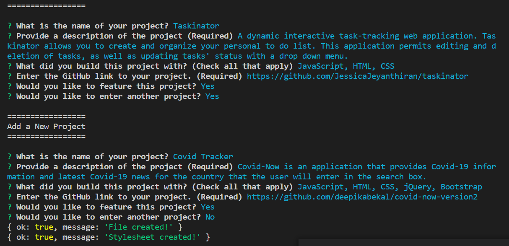
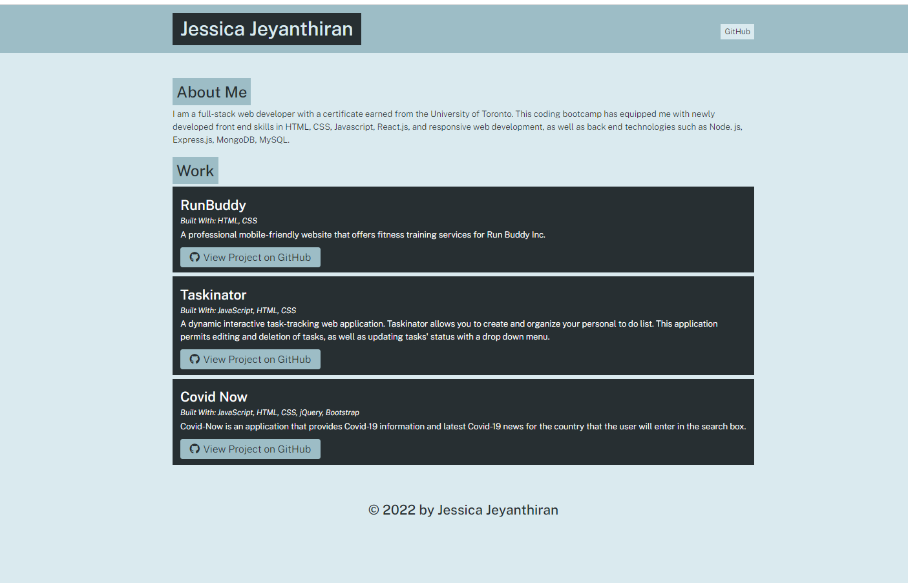

# portfoliogenerator

## Description
This tool is a CLI application that uses Node.js and npm packages to capture and place user input in a JavaScript function to generate a finished HTML portfolio page as output.

## Table of Contents
    * [Technologies](#technologies)
    * [Usage](#usage)
    * [Contribution](#contribution)
    * [Tests](#testing)
    * [Questions?](#questions?)
  
## Installation
Here are some guidelines for installing the project on your local machine to try this app: 
  
  1. ```git clone```  or download this repo to your local machine and open in a code editor. 
  2. Open the terminal, navigate to the root directory of the repo and run ```npm init``` in the command line to download all the required dependencies. This is a CLI Application using Node.js, so it does not have a front end. You must run this project in the command line.
  3. In the root directory of the repo, run ```npm i inquirer``` or ```npm install inquirer``` in the terminal in order to download the npm used in this project. [npm documentation.](https://www.npmjs.com/package/inquirer)
  4. Run ```node app.js``` in your terminal to launch the application and your first question will appear in your terminal.
  5. Once you run the application, you can fill out the all the questions when prompted. Once all questions are answered, the ```index.html``` file is generated on the dist folder. You can use this file to open your portfolio page in the browser.
 

## Technologies
    * Node.js
    * Inquirer npm package
    * HTML
    * CSS
    * JavaScript

## Usage

Your command line should look like the following when the application is running:



The final generated page should look like the following:


  
## Contribution
Made with ❤️ by Jessica Jeyanthiran

## Questions?

Contact me at 

Email: jeyanthiran.jessica@gmail.com

GitHub: https://github.com/JessicaJeyanthiran
